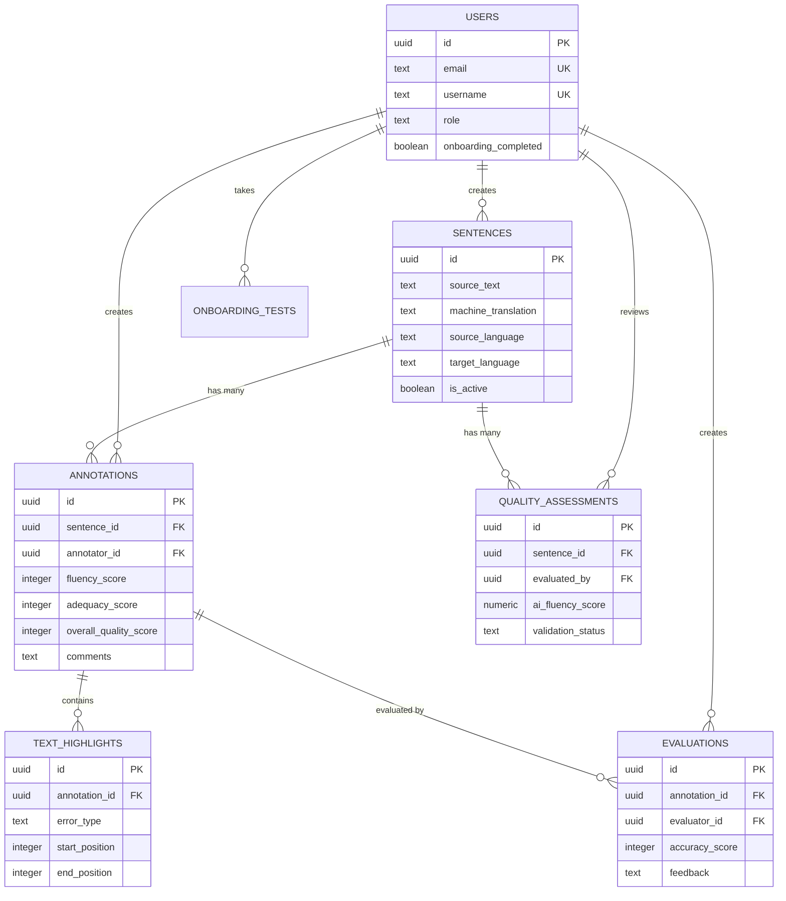

# Database Schema

This document provides the complete database schema for the Lakra system, implemented in PostgreSQL via Supabase.

## Overview

Lakra uses a relational PostgreSQL database with the following core tables:

- `users` - User accounts and profiles
- `sentences` - Source texts and translations to annotate
- `annotations` - Annotation data created by annotators
- `text_highlights` - Error highlights within annotations
- `quality_assessments` - AI-powered quality scores
- `evaluations` - Evaluator reviews of annotations
- `onboarding_tests` - User qualification tests

All tables use Row Level Security (RLS) for access control.

## Core Tables

### users

User accounts and profile information.

```sql
CREATE TABLE users (
  -- Primary key
  id UUID PRIMARY KEY DEFAULT uuid_generate_v4(),
  
  -- Authentication
  email TEXT UNIQUE NOT NULL,
  username TEXT UNIQUE,
  auth_id UUID REFERENCES auth.users(id),
  
  -- Profile
  role TEXT NOT NULL CHECK (role IN ('admin', 'annotator', 'evaluator')),
  full_name TEXT,
  
  -- Language preferences
  source_language TEXT,
  target_language TEXT,
  
  -- Onboarding
  onboarding_completed BOOLEAN DEFAULT FALSE,
  onboarding_score NUMERIC,
  
  -- Activity tracking
  created_at TIMESTAMPTZ DEFAULT NOW(),
  updated_at TIMESTAMPTZ DEFAULT NOW(),
  last_active_at TIMESTAMPTZ,
  
  -- Statistics
  annotations_count INTEGER DEFAULT 0,
  evaluations_count INTEGER DEFAULT 0,
  average_quality_score NUMERIC,
  
  -- Status
  is_active BOOLEAN DEFAULT TRUE
);

-- Indexes
CREATE INDEX idx_users_email ON users(email);
CREATE INDEX idx_users_username ON users(username);
CREATE INDEX idx_users_role ON users(role);
CREATE INDEX idx_users_auth_id ON users(auth_id);
```

**RLS Policies:**
- Users can view their own profile
- Admins can view all users
- Only admins can create/update/delete users

### sentences

Source texts and machine translations to be annotated.

```sql
CREATE TABLE sentences (
  -- Primary key
  id UUID PRIMARY KEY DEFAULT uuid_generate_v4(),
  
  -- Content
  source_text TEXT NOT NULL,
  machine_translation TEXT NOT NULL,
  back_translation TEXT,
  
  -- Language information
  source_language TEXT NOT NULL,
  target_language TEXT NOT NULL,
  
  -- Classification
  domain TEXT,
  context TEXT,
  
  -- Metadata
  created_at TIMESTAMPTZ DEFAULT NOW(),
  created_by UUID REFERENCES users(id),
  updated_at TIMESTAMPTZ DEFAULT NOW(),
  
  -- Status
  is_active BOOLEAN DEFAULT TRUE,
  
  -- Statistics
  annotations_count INTEGER DEFAULT 0,
  average_fluency_score NUMERIC,
  average_adequacy_score NUMERIC,
  average_overall_score NUMERIC
);

-- Indexes
CREATE INDEX idx_sentences_source_lang ON sentences(source_language);
CREATE INDEX idx_sentences_target_lang ON sentences(target_language);
CREATE INDEX idx_sentences_domain ON sentences(domain);
CREATE INDEX idx_sentences_is_active ON sentences(is_active);
CREATE INDEX idx_sentences_created_by ON sentences(created_by);
```

**RLS Policies:**
- All authenticated users can view active sentences
- Only admins can create/update/delete sentences
- Inactive sentences only visible to admins

### annotations

Annotations created by annotators for sentences.

```sql
CREATE TABLE annotations (
  -- Primary key
  id UUID PRIMARY KEY DEFAULT uuid_generate_v4(),
  
  -- Relationships
  sentence_id UUID NOT NULL REFERENCES sentences(id) ON DELETE CASCADE,
  annotator_id UUID NOT NULL REFERENCES users(id) ON DELETE CASCADE,
  
  -- Quality scores (1-5 scale)
  fluency_score INTEGER CHECK (fluency_score BETWEEN 1 AND 5),
  adequacy_score INTEGER CHECK (adequacy_score BETWEEN 1 AND 5),
  overall_quality_score INTEGER CHECK (overall_quality_score BETWEEN 1 AND 5),
  
  -- Annotation content
  comments TEXT,
  suggested_correction TEXT,
  
  -- Voice recording
  voice_recording_url TEXT,
  voice_recording_duration INTEGER, -- in seconds
  
  -- Metadata
  created_at TIMESTAMPTZ DEFAULT NOW(),
  updated_at TIMESTAMPTZ DEFAULT NOW(),
  time_spent_seconds INTEGER, -- time spent on annotation
  
  -- Status
  status TEXT DEFAULT 'completed' CHECK (status IN ('draft', 'completed', 'under_review')),
  
  -- Evaluation metadata
  evaluations_count INTEGER DEFAULT 0,
  average_evaluation_score NUMERIC
);

-- Indexes
CREATE INDEX idx_annotations_sentence_id ON annotations(sentence_id);
CREATE INDEX idx_annotations_annotator_id ON annotations(annotator_id);
CREATE INDEX idx_annotations_status ON annotations(status);
CREATE INDEX idx_annotations_created_at ON annotations(created_at DESC);

-- Constraints
CREATE UNIQUE INDEX idx_annotations_sentence_annotator 
  ON annotations(sentence_id, annotator_id)
  WHERE status != 'draft';
```

**RLS Policies:**
- Annotators can view their own annotations
- Evaluators can view all completed annotations
- Admins can view all annotations
- Only annotation owner can update/delete (before evaluation)

### text_highlights

Error highlights within annotations, marking specific text portions with error classifications.

```sql
CREATE TABLE text_highlights (
  -- Primary key
  id UUID PRIMARY KEY DEFAULT uuid_generate_v4(),
  
  -- Relationships
  annotation_id UUID NOT NULL REFERENCES annotations(id) ON DELETE CASCADE,
  
  -- Highlight position (in machine_translation text)
  start_position INTEGER NOT NULL,
  end_position INTEGER NOT NULL,
  highlighted_text TEXT NOT NULL,
  
  -- Error classification
  error_type TEXT NOT NULL CHECK (
    error_type IN ('MI_ST', 'MI_SE', 'MA_ST', 'MA_SE')
  ),
  -- MI_ST: Minor Syntax
  -- MI_SE: Minor Semantic
  -- MA_ST: Major Syntax
  -- MA_SE: Major Semantic
  
  -- Error details
  error_description TEXT,
  suggested_fix TEXT,
  
  -- Metadata
  created_at TIMESTAMPTZ DEFAULT NOW()
);

-- Indexes
CREATE INDEX idx_text_highlights_annotation_id ON text_highlights(annotation_id);
CREATE INDEX idx_text_highlights_error_type ON text_highlights(error_type);
```

**RLS Policies:**
- Follows same policies as parent annotation
- Accessible to annotation owner and evaluators

### quality_assessments

AI-powered quality assessments for translations.

```sql
CREATE TABLE quality_assessments (
  -- Primary key
  id UUID PRIMARY KEY DEFAULT uuid_generate_v4(),
  
  -- Relationships
  sentence_id UUID NOT NULL REFERENCES sentences(id) ON DELETE CASCADE,
  evaluated_by UUID REFERENCES users(id), -- evaluator who requested/reviewed
  
  -- AI-generated scores
  ai_fluency_score NUMERIC,
  ai_adequacy_score NUMERIC,
  ai_overall_score NUMERIC,
  
  -- Confidence levels (0.0 - 1.0)
  fluency_confidence NUMERIC,
  adequacy_confidence NUMERIC,
  overall_confidence NUMERIC,
  
  -- AI-detected errors
  syntax_errors_detected JSONB, -- Array of detected syntax errors
  semantic_errors_detected JSONB, -- Array of detected semantic errors
  
  -- AI explanations
  ai_explanation TEXT,
  improvement_suggestions TEXT,
  
  -- Human validation
  human_fluency_score INTEGER CHECK (human_fluency_score BETWEEN 1 AND 5),
  human_adequacy_score INTEGER CHECK (human_adequacy_score BETWEEN 1 AND 5),
  human_overall_score INTEGER CHECK (human_overall_score BETWEEN 1 AND 5),
  human_feedback TEXT,
  validation_status TEXT CHECK (
    validation_status IN ('pending', 'confirmed', 'rejected', 'modified')
  ),
  
  -- Metadata
  created_at TIMESTAMPTZ DEFAULT NOW(),
  updated_at TIMESTAMPTZ DEFAULT NOW(),
  processing_time_ms INTEGER,
  ai_model_version TEXT
);

-- Indexes
CREATE INDEX idx_quality_assessments_sentence_id ON quality_assessments(sentence_id);
CREATE INDEX idx_quality_assessments_evaluated_by ON quality_assessments(evaluated_by);
CREATE INDEX idx_quality_assessments_status ON quality_assessments(validation_status);
```

**RLS Policies:**
- Evaluators can view and create quality assessments
- Admins can view all assessments
- Regular annotators can view published assessments (optional)

### evaluations

Evaluator reviews and scores of annotations.

```sql
CREATE TABLE evaluations (
  -- Primary key
  id UUID PRIMARY KEY DEFAULT uuid_generate_v4(),
  
  -- Relationships
  annotation_id UUID NOT NULL REFERENCES annotations(id) ON DELETE CASCADE,
  evaluator_id UUID NOT NULL REFERENCES users(id) ON DELETE CASCADE,
  
  -- Evaluation scores (1-5 scale)
  accuracy_score INTEGER CHECK (accuracy_score BETWEEN 1 AND 5),
  completeness_score INTEGER CHECK (completeness_score BETWEEN 1 AND 5),
  overall_quality_score INTEGER CHECK (overall_quality_score BETWEEN 1 AND 5),
  
  -- Feedback
  feedback TEXT,
  strengths TEXT,
  improvements_needed TEXT,
  
  -- Specific issues identified
  missed_errors TEXT[], -- Array of error descriptions
  incorrect_classifications TEXT[], -- Array of misclassifications
  
  -- Metadata
  created_at TIMESTAMPTZ DEFAULT NOW(),
  updated_at TIMESTAMPTZ DEFAULT NOW(),
  time_spent_seconds INTEGER,
  
  -- Status
  status TEXT DEFAULT 'completed' CHECK (status IN ('draft', 'completed'))
);

-- Indexes
CREATE INDEX idx_evaluations_annotation_id ON evaluations(annotation_id);
CREATE INDEX idx_evaluations_evaluator_id ON evaluations(evaluator_id);
CREATE INDEX idx_evaluations_status ON evaluations(status);
CREATE INDEX idx_evaluations_created_at ON evaluations(created_at DESC);

-- Ensure one evaluation per evaluator per annotation
CREATE UNIQUE INDEX idx_evaluations_annotation_evaluator 
  ON evaluations(annotation_id, evaluator_id);
```

**RLS Policies:**
- Evaluators can view their own evaluations
- Annotation owners can view evaluations of their work (optional)
- Admins can view all evaluations
- Only evaluation owner can update/delete

### onboarding_tests

Tests for qualifying new annotators and evaluators.

```sql
CREATE TABLE onboarding_tests (
  -- Primary key
  id UUID PRIMARY KEY DEFAULT uuid_generate_v4(),
  
  -- Relationships
  user_id UUID NOT NULL REFERENCES users(id) ON DELETE CASCADE,
  
  -- Test configuration
  role TEXT NOT NULL CHECK (role IN ('annotator', 'evaluator')),
  language_pair TEXT NOT NULL, -- e.g., "en-fil"
  
  -- Test data (JSON structure with questions/expected answers)
  test_data JSONB NOT NULL,
  
  -- User responses
  user_responses JSONB,
  
  -- Scoring
  score NUMERIC,
  passing_score NUMERIC NOT NULL,
  passed BOOLEAN,
  
  -- Metadata
  started_at TIMESTAMPTZ DEFAULT NOW(),
  completed_at TIMESTAMPTZ,
  time_spent_seconds INTEGER,
  
  -- Attempt tracking
  attempt_number INTEGER DEFAULT 1
);

-- Indexes
CREATE INDEX idx_onboarding_tests_user_id ON onboarding_tests(user_id);
CREATE INDEX idx_onboarding_tests_role ON onboarding_tests(role);
CREATE INDEX idx_onboarding_tests_passed ON onboarding_tests(passed);
```

**RLS Policies:**
- Users can view their own test attempts
- Admins can view all tests
- Only test owner can update (submit responses)

## Relationships



## Database Functions and Triggers

### Auto-update timestamp trigger

```sql
CREATE OR REPLACE FUNCTION update_updated_at_column()
RETURNS TRIGGER AS $$
BEGIN
  NEW.updated_at = NOW();
  RETURN NEW;
END;
$$ LANGUAGE plpgsql;

-- Apply to relevant tables
CREATE TRIGGER update_users_updated_at
  BEFORE UPDATE ON users
  FOR EACH ROW
  EXECUTE FUNCTION update_updated_at_column();

CREATE TRIGGER update_sentences_updated_at
  BEFORE UPDATE ON sentences
  FOR EACH ROW
  EXECUTE FUNCTION update_updated_at_column();
```

### Update annotation count on sentences

```sql
CREATE OR REPLACE FUNCTION update_sentence_annotation_count()
RETURNS TRIGGER AS $$
BEGIN
  IF TG_OP = 'INSERT' THEN
    UPDATE sentences
    SET annotations_count = annotations_count + 1
    WHERE id = NEW.sentence_id;
  ELSIF TG_OP = 'DELETE' THEN
    UPDATE sentences
    SET annotations_count = annotations_count - 1
    WHERE id = OLD.sentence_id;
  END IF;
  RETURN NULL;
END;
$$ LANGUAGE plpgsql;

CREATE TRIGGER sentence_annotation_count_trigger
  AFTER INSERT OR DELETE ON annotations
  FOR EACH ROW
  EXECUTE FUNCTION update_sentence_annotation_count();
```

### Username-based login RPC

```sql
CREATE OR REPLACE FUNCTION login_with_username(
  username_input TEXT,
  password_input TEXT
)
RETURNS TABLE (
  user_id UUID,
  user_email TEXT
) AS $$
BEGIN
  RETURN QUERY
  SELECT id, email
  FROM users
  WHERE username = username_input;
END;
$$ LANGUAGE plpgsql SECURITY DEFINER;
```

## Indexes for Performance

Key indexes for query optimization:

```sql
-- User lookups
CREATE INDEX idx_users_email ON users(email);
CREATE INDEX idx_users_username ON users(username);
CREATE INDEX idx_users_role ON users(role);

-- Sentence queries
CREATE INDEX idx_sentences_active_source_target 
  ON sentences(is_active, source_language, target_language)
  WHERE is_active = TRUE;

-- Annotation queries
CREATE INDEX idx_annotations_pending_evaluation 
  ON annotations(sentence_id, status)
  WHERE status = 'completed';

-- Recent activity
CREATE INDEX idx_annotations_recent ON annotations(created_at DESC);
CREATE INDEX idx_evaluations_recent ON evaluations(created_at DESC);
```

## Data Migrations

When setting up a new instance:

1. Run table creation scripts in order (users → sentences → annotations → ...)
2. Create indexes
3. Set up RLS policies
4. Create functions and triggers
5. Seed initial data (optional - admin user, sample sentences)

## Backup and Recovery

**Backup Strategy:**
- Daily automated backups via Supabase
- Point-in-time recovery available
- Manual backups before major changes

**Recovery:**
```sql
-- Export data
pg_dump -h {host} -U {user} {database} > backup.sql

-- Restore data
psql -h {host} -U {user} {database} < backup.sql
```

## See Also

- [Architecture](architecture.md) - System architecture
- [API Reference](api-reference.md) - API methods for database access
- [Development](development.md) - Development and migration guidelines
